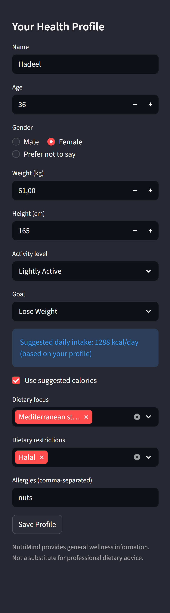
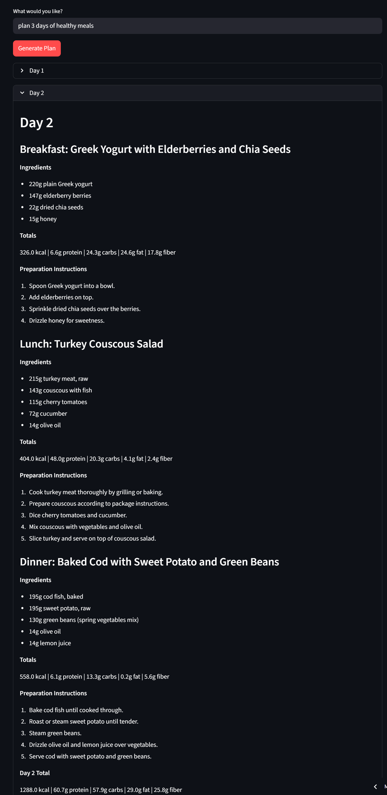
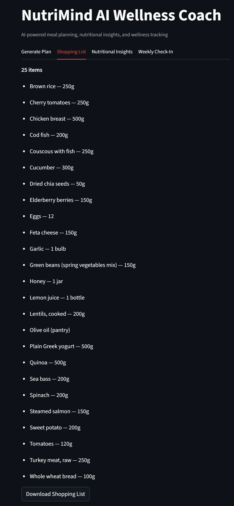
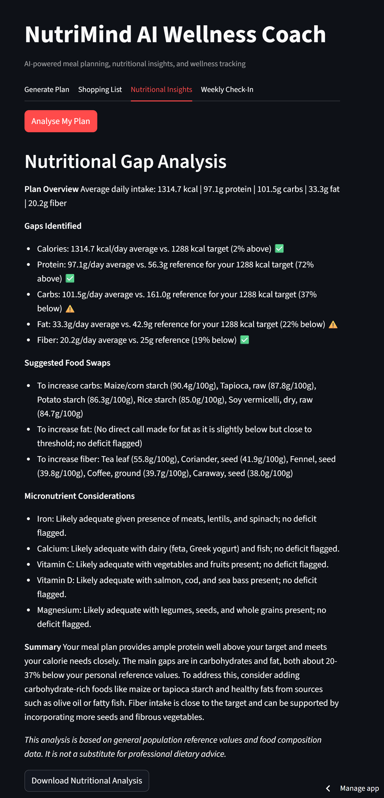
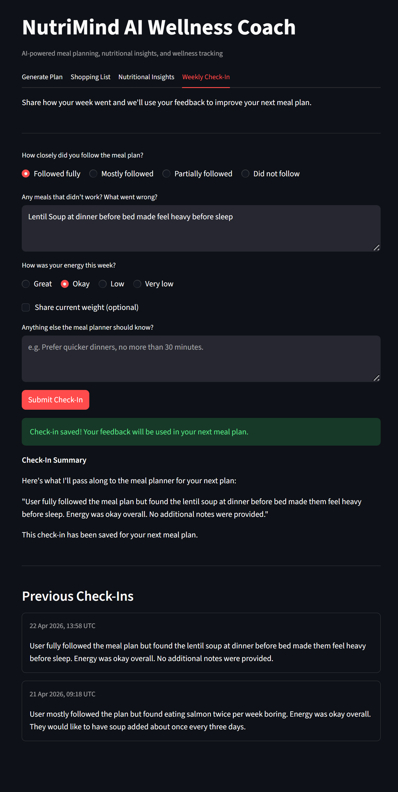
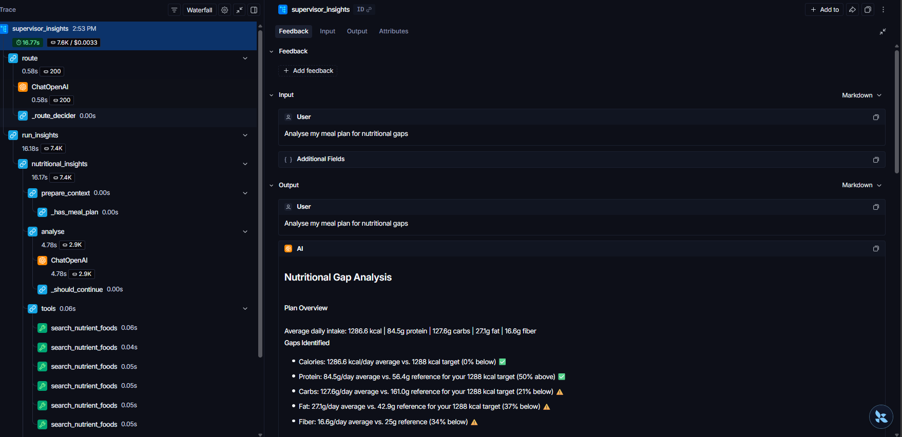

# NutriMind AI Wellness Coach

**Multi-agent AI system for personalised meal planning, nutritional analysis, and wellness tracking.**
Built for the Turing College AI Engineering Capstone. Phase 2 of the NutriMind platform — a LangGraph supervisor coordinating three specialist agents over a shared food-composition and memory layer.

**Live demo:** https://multi-agent-wellness-system.streamlit.app/

---

## Table of Contents

1. [Project Overview](#1-project-overview)
2. [Screenshots](#2-screenshots)
3. [Architecture](#3-architecture)
4. [Setup](#4-setup)
5. [How to Use](#5-how-to-use)
6. [Technical Decisions](#6-technical-decisions)
7. [Capstone Requirements Mapping](#7-capstone-requirements-mapping)
8. [Sprint 3 Foundation → Capstone Build](#8-sprint-3-foundation--capstone-build)
9. [Ethical Assessment](#9-ethical-assessment)
10. [Known Limitations](#10-known-limitations)
11. [Future Roadmap](#11-future-roadmap)
12. [Project Structure](#12-project-structure)
13. [Dependencies](#13-dependencies)

---

## 1. Project Overview

### What it does

NutriMind is a multi-agent AI wellness coach that generates nutritionally validated meal plans, analyses those plans for gaps and food-based corrections, and tracks qualitative weekly feedback that loops back into the next plan. Every recommendation is grounded in the CIQUAL 2025 French food composition database (3,484 foods) and a ChromaDB-backed food-safety knowledge base — the LLM never invents nutritional numbers.

### Who it's for

People who want evidence-based meal planning that respects their individual goals, dietary restrictions, and allergies — without wading through nutrition spreadsheets themselves. The design is deliberately consumer-facing (a Streamlit app with four tabs) but the underlying architecture is production-track: a supervisor with sub-graphs, explicit state contracts, and liability boundaries baked into every prompt.

### The problem it solves

Generic meal generators ignore individual health profiles and invent nutritional data. NutriMind grounds every macro and micronutrient value in a tabular lookup, enforces allergen and calorie constraints programmatically (not just in prompts), and separates the three distinct tasks a real coach performs — planning, analysing, checking in — into three specialist agents. A LangGraph **supervisor** performs runtime intent classification and routes each user message to the right agent: **Meal Planner**, **Nutritional Insights**, or **Check-In**. Feedback collected in check-ins is injected as soft preferences into the next meal plan, closing the feedback loop across sessions.

---

## 2. Screenshots

### Sidebar Profile with TDEE


### Meal Plan with Per-Day Expanders


### Shopping List with HTML Export


### Nutritional Insights — Gap Analysis + Food Swaps


### Weekly Check-In


### Observability (LangSmith)

All agent runs are traced via LangSmith — every supervisor routing decision, every sub-agent invocation, every tool call, and every LLM message is captured with latency and token usage. Distinct `run_name` values (`supervisor_meal_plan`, `supervisor_insights`, `weekly_check_in`) make the three routes filterable in the dashboard.

**All three supervisor routes captured:**


**Meal Planner trace** — route → allergen checks → nutrition lookups:


**Nutritional Insights trace** — route → gap analysis → nutrient food search:


---

## 3. Architecture

```
                              User (Streamlit UI — app.py)
                                         │
                                         ▼
                              ┌──────────────────────┐
                              │     Supervisor       │
                              │  (core/supervisor.py)│
                              │   LLM intent router  │
                              └──────────┬───────────┘
                                         │ route_to:
                       ┌─────────────────┼─────────────────┬────────────────┐
                       ▼                 ▼                 ▼                ▼
              ┌────────────────┐ ┌────────────────┐ ┌────────────────┐ ┌──────────┐
              │ Meal Planner   │ │ Nutritional    │ │ Check-In       │ │ Clarify  │
              │ Agent          │ │ Insights Agent │ │ Agent          │ │ (fallback)│
              │ core/graph.py  │ │ agents/        │ │ agents/        │ │          │
              │ (Sprint 3)     │ │  insights/     │ │  checkin/      │ │          │
              └────────┬───────┘ └────────┬───────┘ └────────┬───────┘ └──────────┘
                       │                  │                  │
                       └──────────────────┼──────────────────┘
                                          ▼
                ┌─────────────────────────────────────────────────────────┐
                │                     Shared Layer                        │
                │  ┌──────────────┐  ┌──────────────┐  ┌───────────────┐ │
                │  │ CIQUAL 2025  │  │ ChromaDB KB  │  │ SQLite        │ │
                │  │ (pandas)     │  │ (RAG + query │  │ profiles +    │ │
                │  │ 3,484 foods  │  │  translation)│  │ check_ins     │ │
                │  └──────────────┘  └──────────────┘  └───────────────┘ │
                └─────────────────────────────────────────────────────────┘

                         LangSmith auto-instruments every node
                          (project: nutrimind-capstone)
```

### Supervisor graph (`core/supervisor.py`)

| Node | Responsibility |
|------|---------------|
| `route` | LLM intent classification — calls `gpt-4.1-mini` with `SUPERVISOR_ROUTING_PROMPT`, parses JSON, falls back to `clarify` on bad JSON, unknown routes, or empty input |
| `run_meal_planner` | Maps `SupervisorState` → `AgentState`, injects recent check-in feedback as soft preferences, invokes the Sprint 3 meal agent, maps results back |
| `run_insights` | Lazy-imports the insights agent, guards against empty meal plans, invokes with `recursion_limit=40`, returns structured `insights` dict |
| `run_check_in` | Lazy-imports the check-in agent, invokes it, merges the new summary into `check_in_history` (keeps latest 2) |
| `clarify` | Fallback — returns a menu-style prompt: "I can help with meal planning, nutritional insights, or a weekly check-in" |

### Meal Planner agent (`core/graph.py` — Sprint 3 baseline, preserved)

| Node | Responsibility |
|------|---------------|
| `load_profile` | Reads the user's SQLite profile and injects it into state |
| `agent` | ReAct reasoning with `gpt-4.1-mini` + four bound tools; 3× retry on `RateLimitError` |
| `tools` | `ToolNode` running `check_allergens`, `lookup_nutrition`, `score_meal_health`, `validate_meal_safety`; `RetryPolicy(max_attempts=3)` |
| `validate_calories` | Programmatic feedback loop — regex-parses per-day totals, routes back to `agent` with correction if outside ±10% of target (cap: 2 retries) |
| `format_output` | LLM post-processor — extracts structured `meal_plan` dict + `shopping_list` |

### Nutritional Insights agent (`agents/insights/graph.py`)

| Node | Responsibility |
|------|---------------|
| `prepare_context` | Pure function — formats the meal plan dict + profile into a `HumanMessage`. Short-circuits to END if plan is empty |
| `analyse` | ReAct reasoning with `gpt-4.1-mini` bound to `search_nutrient_foods` and `lookup_nutrition`; calorie-proportional and Gender-specific references baked into the system prompt |
| `tools` | `ToolNode` for CIQUAL lookups (with impractical-food filters applied at the tool layer) |
| `format_insights` | Regex-parses the agent's markdown into `nutrient_gaps[]`, `suggestions[]`, and `summary`; falls back to storing raw text if parsing finds nothing |

### Check-In agent (`agents/checkin/graph.py`)

| Node | Responsibility |
|------|---------------|
| `prepare_context` | Loads the user's most recent check-in from SQLite, injects a `SystemMessage` so the user's message stays the latest HumanMessage |
| `collect_feedback` | Single LLM call — asks all five questions on turn 1 or emits the `**Check-In Summary**` block on turn 2 |
| `save_check_in_node` | Regex-extracts the quoted summary; persists to SQLite only when the marker is present — silent no-op while the agent is still asking |

---

## 4. Setup

### Prerequisites

- Python 3.11+
- OpenAI API key (for `gpt-4.1-mini`)
- Sprint 2 ChromaDB knowledge base (optional — the RAG validator degrades gracefully)
- LangSmith API key (optional — tracing is disabled when the key is absent)

### Steps

**1. Clone the repository**
```bash
git clone <repo-url>
cd "Multi-Agent Wellness System"
```

**2. Create and activate a virtual environment**
```bash
python -m venv .venv

# macOS / Linux
source .venv/bin/activate

# Windows
.venv\Scripts\activate
```

**3. Install dependencies**
```bash
pip install -r requirements.txt
```

**4. Configure environment variables**
```bash
cp .env.example .env
```

Open `.env` and fill in:
```env
OPENAI_API_KEY=sk-...

# LangSmith (optional but recommended)
LANGCHAIN_TRACING_V2=true
LANGCHAIN_API_KEY=ls__...
LANGCHAIN_PROJECT=nutrimind-capstone

# SQLite path
MEMORY_DB_PATH=data/user_profiles.db
```

**5. CIQUAL nutritional data**

Already included at [data/ciqual/ciqual_cleaned.csv](data/ciqual/ciqual_cleaned.csv) with macronutrients **and** the six micronutrients (iron, calcium, vitamin C, vitamin D, sodium, magnesium) added by [scripts/expand_ciqual.py](scripts/expand_ciqual.py).

**6. ChromaDB knowledge base (optional)**

Copy the Sprint 2 ChromaDB directory to `knowledge_base/data/chroma_db/` (collection: `nutrition_kb`). If absent, the RAG validator returns a graceful fallback — the rest of the system works.

**7. Run the app**
```bash
streamlit run app.py
```

The app opens at `http://localhost:8501`.

**8. Run the tests**
```bash
# Unit tests (no API key required, ~3 seconds)
pytest tests/test_tools.py tests/test_tdee.py tests/test_nutrient_search.py tests/test_supervisor.py tests/test_insights.py tests/test_checkin.py -v

# End-to-end test (requires OPENAI_API_KEY, ~2–4 minutes)
pytest tests/test_e2e.py -v -s
```

---

## 5. How to Use

The UI is organised as four tabs, all routed through the supervisor.

### Step 1 — Fill in your health profile (sidebar)

| Field | Example |
|-------|---------|
| Name | Alex |
| Age | 32 |
| Gender | Male |
| Weight | 70 kg |
| Height | 168 cm |
| Activity level | Moderate |
| Goal | Lose weight |

NutriMind computes a **suggested daily calorie target** using the Mifflin-St Jeor equation. An `st.info` banner shows the suggestion; a checkbox lets you accept it or unlock a manual override. `calorie_source` ("calculated" | "manual") is persisted to SQLite. Click **Save Profile** to persist.

### Step 2 — Tab 1: Generate Plan

Example prompts the supervisor routes to the **Meal Planner**:
```
Plan 3 days of healthy meals for me
Give me a 5-day vegan high-protein plan around 1600 kcal
I need gluten-free dinners for the next 2 days
```

Output is rendered as per-day expanders with Warnings / Ingredients / Macros sections, plus a markdown-to-HTML download button for a printable plan.

### Step 3 — Tab 2: Shopping List

Deduplicated, alphabetised, with realistic supermarket quantities. Downloadable as a browser-printable HTML checklist with real `<input type="checkbox">` items.

### Step 4 — Tab 3: Nutritional Insights

Example prompts routed to the **Insights Agent**:
```
Analyse my current plan
What am I missing nutritionally?
Identify any gaps in this meal plan
```

Output structure:
- **Gaps Identified** — each nutrient as `- Name: Xg/day average vs. Yg reference (Z% below/above) ⚠️/✅`
- **Recommended Food Swaps** — per gap, top foods from CIQUAL
- **Summary** — 3–4 sentence narrative
- Closing liability disclaimer

References are **calorie-proportional and Gender-specific** — a user on a 1,300 kcal target is not compared against a 2,000 kcal population average.

### Step 5 — Tab 4: Weekly Check-In

A structured form asks five questions: adherence, problem meals, energy level, optional weight, additional notes. The agent emits a `**Check-In Summary**` block which is persisted to the `check_ins` SQLite table. The latest summary is automatically injected as soft preferences into the next meal plan — closing the feedback loop across sessions.

---

## 6. Technical Decisions

### Why LangGraph over CrewAI

Stack consistency with the Sprint 3 meal planner (which was already LangGraph ReAct), fine-grained control over state shape and conditional routing, native support for compiled sub-graphs invoked from a parent graph, and first-class observability through LangSmith. CrewAI abstracts too much of the routing logic — the reviewer narrative for this capstone depends on demonstrating an explicit LLM-driven routing decision at runtime, which is more legible in LangGraph's `add_conditional_edges` pattern.

### Why CIQUAL as pandas, not ChromaDB

CIQUAL is structured tabular data: 3,484 foods × ~12 numeric columns. Vector search on this is lossy — embeddings of "chicken breast: 165 kcal" do not reliably retrieve precise numbers. Pandas substring + difflib fallback returns exact, reproducible values. ChromaDB is reserved for unstructured food-safety text (additives, allergens, EU ingredient law) where semantic similarity actually helps.

### Why Mifflin-St Jeor for TDEE

Mifflin-St Jeor is the published, peer-reviewed BMR equation recommended by the Academy of Nutrition and Dietetics for healthy adults. It's deterministic, doesn't require body-fat percentage (Katch-McArdle), and has narrower prediction intervals than Harris-Benedict for the general population. The implementation in [core/tdee.py](core/tdee.py) is a pure function with no I/O, a 1,200 kcal physiological floor, and a `calorie_source` field that persists *whether* the target was calculated or manually overridden — enforcing the liability rule "we suggest, the user decides".

### Why regex parsing for insights (not JSON mode)

The insights agent produces user-visible markdown that flows through Streamlit's `st.markdown`. Asking the LLM for both JSON (for structured state) and markdown (for rendering) doubles the token cost and drift surface. Instead, the prompt enforces a strict markdown format (`- Nutrient: Xg/day average vs. Yg reference (Z% direction) ⚠️/✅`) and the `format_insights` node regex-parses that same markdown into structured fields. If the regex misses, the raw markdown is stored in `summary` — the user still sees a full analysis, and nothing crashes.

### Why qualitative check-ins (no automatic calorie adjustment)

Automatic calorie adjustment based on self-reported weight trends is the highest-liability feature in a wellness app. Under-eating cycles, eating-disorder patterns, and medical weight fluctuations all look like "not losing fast enough" to a naive loop. NutriMind explicitly refuses to recalculate calories from check-in data — it collects qualitative feedback (adherence, problem meals, energy, notes) and injects it as *soft preferences* into the next plan. If the user reports weight, the agent acknowledges it and points them at the profile settings. This is a direct application of the project's **liability framework** (see [CLAUDE.md](CLAUDE.md) Liability Boundaries section and [docs/ETHICAL_ASSESSMENT.md](docs/ETHICAL_ASSESSMENT.md)).

### Other notable decisions

- **String-only tool parameters.** LangChain tools accept only `str`/`int`/`float`; each tool parses structured data internally. Eliminated an entire category of malformed-JSON agent failures observed in Sprint 2.
- **Impractical-food exclusion filter.** `search_nutrient_foods` filters out corn bran, tea leaf, cod liver oil, etc. when no `food_group` is specified — nutritionally dense but practically useless swap suggestions.
- **Lazy agent imports in the supervisor.** `run_insights` and `run_check_in` lazy-import their sub-agents to avoid circular imports at module load time.
- **Check-in marker as save trigger.** Persistence only happens if the agent emits `**Check-In Summary**`. Absence is a meaningful signal (don't save until the user has actually answered) — no extra LLM call needed.

---

## 7. Capstone Requirements Mapping

| Rubric criterion | Implementation |
|------------------|---------------|
| Multi-agent architecture | LangGraph supervisor + three specialist sub-agents, each compiled independently. See [core/supervisor.py](core/supervisor.py) |
| Genuine agentic behaviour | Two levels: **routing-level** (LLM intent classification in the supervisor) and **task-level** (calorie validation feedback loop in the meal planner) |
| RAG / external knowledge | CIQUAL pandas lookup (structured) + ChromaDB RAG with query translation (unstructured food-safety KB) |
| Memory / personalisation | SQLite profiles with TDEE fields + `check_ins` table; check-in feedback injected into meal planner across sessions |
| Error handling | `try/except` on every agent invocation, 3× `RateLimitError` retries in each ReAct node, `RetryPolicy(max_attempts=3)` on every `ToolNode`, graceful ChromaDB fallback |
| Tool use | 6 tools — `check_allergens`, `lookup_nutrition`, `score_meal_health`, `validate_meal_safety`, `search_nutrient_foods`, + internal calorie validator |
| Observability | LangSmith auto-instrumentation; distinct `run_name` per invocation (`supervisor_meal_plan`, `supervisor_insights`, `weekly_check_in`) with metadata tags |
| UI / deployment | Streamlit app deployed to Streamlit Community Cloud; HTML download exports for plan / shopping list / insights |
| Testing | `test_tools`, `test_tdee`, `test_supervisor`, `test_insights`, `test_checkin`, `test_nutrient_search`, `test_e2e` |
| Ethical assessment | [docs/ETHICAL_ASSESSMENT.md](docs/ETHICAL_ASSESSMENT.md) + liability framework enforced in every agent prompt |

---

## 8. Sprint 3 Foundation → Capstone Build

Sprint 3 shipped the meal planner agent (LangGraph ReAct, 4 tools, CIQUAL pandas lookup, ChromaDB RAG with query translation, SQLite profiles, Streamlit deployment, LangSmith). Post-review fixes addressed the calorie-per-100g bug, shopping list quantities, dietary-warning prominence, model upgrade to `gpt-4.1-mini`, draft-revision cycles in output, and the agentic calorie-validation loop (Fix 7). Full detail in [CHANGELOG_SPRINT3_FIXES.md](CHANGELOG_SPRINT3_FIXES.md).

The capstone preserved every Sprint 3 file exactly where it was and built on top:

- **TDEE calculator** (Mifflin-St Jeor, activity + goal, 1,200 kcal floor)
- **LangGraph supervisor** with LLM-based intent routing
- **Nutritional Insights agent** with calorie-proportional and Gender-specific references, impractical-food exclusion filter, and regex-parsed structured output
- **`search_nutrient_foods` tool** + CIQUAL micronutrient expansion (6 new columns)
- **Check-In agent** (linear 3-node graph, single-turn summary flow, SQLite persistence)
- **Cross-agent context injection** — check-in feedback survives browser resets via SQLite fallback and is injected into the meal planner as soft preferences (not hard rules)
- **HTML download exports** for meal plan / shopping list / insights
- **UI polish** — title rename, subtitle, sidebar disclaimer, weekly check-in tab

Full capstone change log in [CHANGELOG_CAPSTONE.md](CHANGELOG_CAPSTONE.md).

---

## 9. Ethical Assessment

NutriMind provides **general wellness information based on food composition data** — it does not diagnose, prescribe, or replace professional dietary advice. Every agent system prompt enforces the project's liability boundaries:

1. No supplement dosage recommendations — food-based swaps only
2. No medical claims ("lowers cholesterol", "prevents X")
3. No calorie auto-adjustment — the user sets or confirms their own target
4. No weight trend commentary
5. No condition-specific advice
6. Allergen checks are informational, not a substitute for reading labels
7. Every response carries a general wellness disclaimer

Full assessment — including data privacy (local SQLite, no analytics), bias considerations (CIQUAL's European food bias), and vulnerable-user guidance — in [docs/ETHICAL_ASSESSMENT.md](docs/ETHICAL_ASSESSMENT.md).

---

## 10. Known Limitations

**CIQUAL coverage gaps.** CIQUAL is a French database. Foods common in non-European cuisines (black beans, tortillas, miso) may fall back to fuzzy matches or approximate values. The system logs this and proceeds rather than silently substituting.

**Single-user SQLite.** `user_id` is hardcoded to `"default_user"`. Multi-user support requires authentication — deferred to the commercial track.

**Streamlit Cloud cold starts.** On first invocation after idle, ChromaDB is rebuilt in-memory via `EphemeralClient` (a workaround for Streamlit Cloud's read-only filesystem). Expect 5–15 seconds of cold-start latency.

**Format sensitivity.** Both the meal planner's `format_output` and the insights agent's `format_insights` depend on the LLM emitting the exact markdown/JSON structure specified in the prompt. When the LLM drifts off-format, the raw text is surfaced to the user (no crash) — but structured state fields may be empty.

**Micronutrient NaN rates.** CIQUAL has complete macronutrient coverage, but iron, vitamin D, and vitamin C are sparse for some foods. The insights agent treats micronutrient analysis as qualitative (the meal plan dict carries no per-meal micronutrient totals) and flags when data is unavailable.

**Insights agent depends on a generated plan.** The supervisor guards against empty input and returns a user-facing message; there is no standalone "analyse this food I ate" mode.

**Profile and check-in data does not persist on Streamlit Cloud.** Streamlit Cloud uses an ephemeral filesystem — SQLite databases created at runtime are wiped when the app sleeps after inactivity or restarts. User profiles and check-in history persist within a single session but are lost on cold start. The production version will use Supabase for persistent cloud storage (see Future Roadmap).

**Check-in preferences are soft constraints.** The meal planner treats check-in feedback as preferences to balance against calorie targets, allergen rules, and nutritional goals. It may approximate rather than exactly match requested frequencies (e.g., "soup once every three days" may yield slightly more or fewer occurrences).

---

## 11. Future Roadmap

These are scoped for the **commercial product track**, not the capstone submission.

| Feature | Horizon |
|---------|---------|
| **FastAPI backend** wrapping `core/` + `agents/` | Post-course, 2–3 weeks |
| **Flutter mobile app** replacing Streamlit prototype | Post-course, 4–6 weeks |
| **Supabase auth** — multi-user, row-level security, replacing `"default_user"` | Late June–July |
| **Open Food Facts** barcode scanning — branded/packaged food validation | Post-course |
| **Incremental meal editing** — modify individual meals without regenerating the full plan | Post-course |
| **AWS deployment** (EC2 / Elastic Beanstalk) with always-on hosting | Pre-August |
| **Google Play soft launch** | Target: late July |
| Full nutrient-interaction knowledge base | Post-course |
| Supplement recommendations (pending liability review) | TBD |
| Weight trend analysis + adaptive calorie adjustment | Deferred indefinitely — liability concern |

---

## 12. Project Structure

```
Multi-Agent Wellness System/
├── app.py                              # Streamlit UI — routes through supervisor, four tabs
├── core/
│   ├── graph.py                        # Sprint 3 meal planner graph (preserved)
│   ├── state.py                        # AgentState + SupervisorState + InsightsAgentState + CheckInAgentState
│   ├── memory.py                       # SQLite — profiles + check_ins, TDEE fields, safe migrations
│   ├── supervisor.py                   # LangGraph supervisor + route/run_*/clarify nodes
│   └── tdee.py                         # Mifflin-St Jeor pure function + activity/goal modifiers
├── tools/
│   ├── nutrition_lookup.py             # CIQUAL pandas lookup (macros + 6 micronutrients)
│   ├── allergen_checker.py             # EU allergen mapping + direct matching
│   ├── health_scorer.py                # 1–10 meal quality score
│   ├── rag_validator.py                # ChromaDB RAG with query translation
│   └── nutrient_search.py              # "Top N foods by nutrient" + impractical-food filter
├── agents/
│   ├── insights/
│   │   └── graph.py                    # prepare_context → analyse ↔ tools → format_insights
│   └── checkin/
│       └── graph.py                    # prepare_context → collect_feedback → save_check_in_node
├── prompts/
│   └── system_prompts.py               # All prompts — supervisor, meal planner, insights, check-in
├── data/
│   ├── ciqual/ciqual_cleaned.csv       # CIQUAL 2025 food composition table (expanded)
│   └── user_profiles.db                # SQLite (profiles + check_ins, created at runtime)
├── knowledge_base/
│   └── data/chroma_db/                 # Sprint 2 ChromaDB (optional — graceful fallback)
├── scripts/
│   └── expand_ciqual.py                # Reproducible CIQUAL micronutrient expansion
├── tests/
│   ├── test_tools.py
│   ├── test_tdee.py
│   ├── test_supervisor.py
│   ├── test_insights.py
│   ├── test_checkin.py
│   ├── test_nutrient_search.py
│   └── test_e2e.py
├── docs/
│   ├── screenshots/
│   └── ETHICAL_ASSESSMENT.md
├── CHANGELOG_CAPSTONE.md
├── CHANGELOG_SPRINT3_FIXES.md
├── README.md                           # This file
├── .env.example
└── requirements.txt
```

---

## 13. Dependencies

| Package | Purpose |
|---------|---------|
| `langgraph` | Agent graph orchestration — supervisor, meal planner, insights, check-in |
| `langchain` + `langchain-openai` + `langchain-community` | LLM bindings, tool decorators, message types |
| `chromadb` | Vector store for the Sprint 2 food-safety knowledge base |
| `pandas` + `openpyxl` | CIQUAL CSV / Excel lookups |
| `streamlit` | Four-tab web UI with HTML export buttons |
| `python-dotenv` | Environment variable loading |
| `langsmith` | Observability — traces every supervisor invocation |
| `pydantic` | Data validation (used by LangChain internals) |

---

*Built for the Turing College AI Engineering Capstone — submitted April 2026.*
*Phase 2 of the NutriMind AI Wellness Coach — commercial product track planned post-course.*
